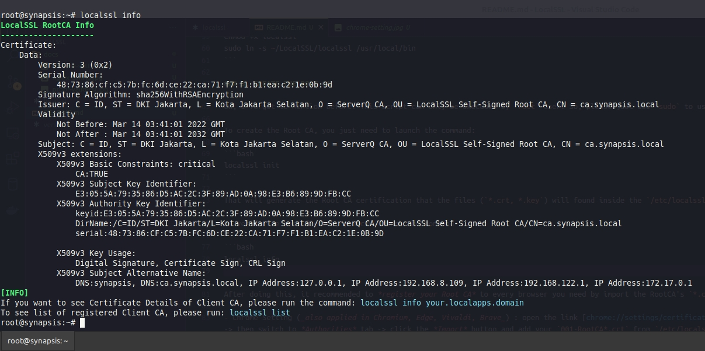

# BASH Script: `localssl`

_A **valid** Self-Signed SSL Certificate to support HTTPS on Local Application Development that just works._

## HIGHLIGHTS

1. Turn your machine into the Root CA Authority that can create **valid SSL certificates*& to your local development apps as many as you like.
2. maintain & register your FQDN (locally) that could accessed via Chrome & many modern browser with NO MORE display annoying `ERR_CERT_COMMON_NAME_INVALID` errors.

## PROOF


Don't see the red lock icon on that https-enabled local domain? Yeah, you right!

FYI, the `worksuite.pv` is my example of self-defined domain that will registered automatically via this `localssl` scripts into `/etc/hosts` file.
I use that domain on one of my `server_name` in nginx configuration (`VirtualHost` -equivalent in apache).

Like this:


## BUT...

After once your machine became the Root CA, you need to let Chrome (and any other browser) know that you are now a Trusted CA. To do that, just open `chrome://settings/certificates` and import your `001-RootCA-*.crt` generated via this script (will found on `/etc/localssl.certs/` folder).


You just need to do this **one time only**.

## HOW-TO USE

### 1. PRE-REQUISITES

Required Package :

```bash
sudo apt-get install openssl ca-certificates
```

### 2. INSTALLATION

To implement this on your Linux Box (Debian/Ubuntu/their derivative OS), you have **no need** to `git clone` this repo (although clone is the recommended way, IMO). Just [download from here](https://raw.githubusercontent.com/Dev-Op5/localssl/master/localssl) and copy the `localssl` file to folder `/usr/local/bin`. 

```bash
cd /tmp
wget https://raw.githubusercontent.com/Dev-Op5/localssl/master/localssl
chmod +x /tmp/localssl
sudo cp /tmp/localssl /usr/local/bin
```

Of course, there is no restriction if you wanna fork this repo and changes the code to suit your needs. I'll be happy if you add the functionality to this script to make this more powerful. Please don't hesitate to gimme pull requests.

Example :

```bash
mkdir -p ~/LocalSSL
cd ~/LocalSSL
git clone https://github.com/Dev-Op5/localssl.git .
chmod +x localssl
sudo ln -s ~/LocalSSL/localssl /usr/local/bin 
```

### 3. CREATE THE ROOT CA

Ow, I forgot to mention before. This script can only be executed by `root` user. So, please just use `sudo` to use this.

To create the Root CA, you just need to launch the command:

```bash
localssl init
```

That will generate the Root CA certification that the files (`*.crt, *.key`) will found inside the `/etc/localssl.certs` folder. 

To verify the certificates, you can launch the command

```bash
localssl info
```

Example result:



> :thumbsup: **You see it just right!** :alien: :alien:
>
> The generated Root CA is following the current standard of **x509v3 Subject Alternative Name** that required by modern browser just like [Chrome](https://www.thesslstore.com/blog/security-changes-in-chrome-58/) and [MacOS/Safari](https://support.apple.com/en-us/HT210176) announced on the linked articles. And that's why the browsers will mark this Root CA as **Trusted and Valid** SSL issuer.

After doing the Root CA initialization, it is recommended to *register your Root CA* to every browser you need by import the RootCA's `*.crt` file into the browser settings.

- Chrome Setting (_also applied in Chromium, Edge, Vivaldi, Brave_) : open the link `chrome://settings/certificates` in your Chrome Address Bar -> then switch to **Authorities** tab -> click the **Import** button and add your `001-RootCA*.crt` from `/etc/localssl.certs` folder.
- Firefox Setting : refer to [this article](https://support.mozilla.org/en-US/kb/setting-certificate-authorities-firefox) or open the `about:preferences` from Firefox Address Bar -> then type to search "Certificates" -> then click the button `View Certificates`. The Certificate Manager window will open, and you can import the `*.crt` on the **Authorities** tab.
- Android Chrome Setting : transfer your `001-RootCA.crt` to your Android device, open Android setting, in **Security** section select `Encryption & Credentials` -> `Install a certificate` -> `CA certificate` -> then select the transferred certificate. _Note:_ eventually this custom self-signed Root CA will only be used by Android Chrome Browser and/or WebView apps that using chrome browser as their engine. Other apps (or native apps) don't trust self-signed certificates installed.

Don't worry, you just need to do this one time only, _except_ you made changes/remove/and-or recreate of your RootCA.

> :thumbsup: **to make Valid Self-Signed SSL accessed from other devices (inside same local network)**
>
> You can copy your `001-RootCA*.crt` to other machine and do the certificate's import mechanism like explained above to make the other device (within the same local network) could recognized your Root CA as a Valid & Trusted CA issuer.


### 4. REGISTER THE CLIENT CA

To create the Client CA, you just need to launch `localssl register <space> your-awesome-domain-address`

For example:

```bash
localssl register laravel9.trial
```

which, the `laravel9.trial` is your chosen domain address that soon to be registered on your Web Server config.

The `localssl register` command will also generate some certification files (`*.crt, *.csr, *.key`) inside the same `/etc/localssl.certs` folder **and** they also register the new line in your `/etc/hosts` file some extra entry about your domain.

```
127.0.0.1  laravel9.trial
```

You can use the `*.crt` and `*.key` generated to be attached in your Web Server config, for example:

**NGINX**

```
server {
   ...
   ssl_certificate        /etc/localssl.certs/laravel9.trial.crt;
   ssl_certificate_key    /etc/localssl.certs/laravel9.trial.key;
   ...
}
```

**APACHE 2**

```
...
SSLEngine on
SSLCertificateFile /etc/localssl.certs/laravel9.trial.crt
SSLCertificateKeyFile /etc/localssl.certs/laravel9.trial.key
...
```

After restart the web-server, you could access your apps via your browser: `https://laravel9.trial` -- _perfectly with a Valid & Trusted Certificate_

## MISC : REMOVE

To remove the Client CA (one of your previously-created), you just need to launch `localssl remove <space> your-awesome-domain-address`

To remove the Root CA, run `localssl purge` without any other parameters. This will also remove all of your previous Client CAs.

And yeah -- for your convenience -- the `remove` and `purge` procedures also cleanup the `/etc/hosts` entry. :green_heart:

## MISC : HELP

Just launch `localssl help` to explore further options, or you can read the source-code instead to understand the pattern of this script.


# ENJOY!